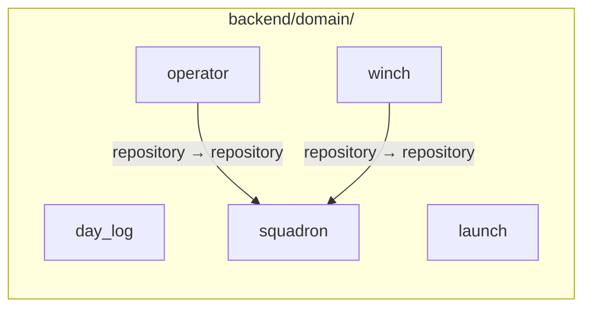
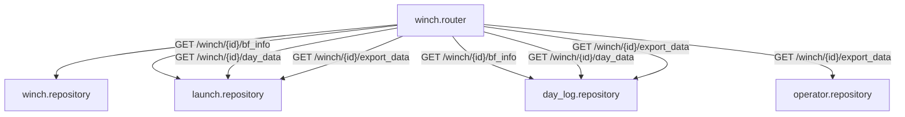
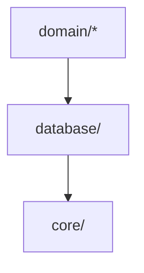

# Backend domain diagram

Source of truth: `backend/.importlinter`. This diagram is generated by reading
that contract, not the other way round — if the contract changes, this
diagram is stale until regenerated by hand.

## Domains

Each domain lives under `backend/domain/{name}/` and contains its own
`model.py`, `repository.py`, `router.py`, and `schema.py`. The independence
contract in `.importlinter` treats these five as siblings that must not
import each other, subject to the explicit exceptions below.

- `domain.day_log`
- `domain.launch`
- `domain.operator`
- `domain.squadron`
- `domain.winch`

## Legitimate sibling imports

The independence contract's `ignore_imports` list is the exhaustive set of
permitted cross-domain repository imports. There are no others.

`operator.repository.get_operators_from_sqn` calls
`squadron.repository.squadron_exists` to validate the squadron before
querying. `winch.repository.get_winches_from_sqn` does the same. Squadron is
therefore the one domain every other domain is permitted to depend on for
existence checks; the contract does not permit the reverse, and does not
permit `day_log`, `launch`, or `operator`↔`winch` to import each other's
repositories at all.

## Router-level orchestration (reads only)

`domain.winch.router` is the one router permitted to import repositories
from other domains directly (`day_log`, `launch`, `operator`), per the
`ignore_imports` exceptions for `domain.winch.router`. It uses this to
assemble read-only, cross-domain response payloads — it does not write.

Endpoint ownership:

| Endpoint                                                                                      | Owning router    | Repositories read                           |
|-----------------------------------------------------------------------------------------------|------------------|---------------------------------------------|
| `GET /winches/{winch_id}`                                                                     | `winch.router`   | `winch`                                     |
| `GET /squadrons/{squadron_id}/winches`                                                        | `winch.router`   | `winch`, `squadron` (via `squadron_exists`) |
| `GET /winch/{winch_id}/bf_info`                                                               | `winch.router`   | `launch`, `day_log`                         |
| `GET /winch/{winch_id}/day_data`                                                              | `winch.router`   | `day_log`, `launch`                         |
| `GET /winch/{winch_id}/export_data`                                                           | `winch.router`   | `winch`, `day_log`, `launch`, `operator`    |
| `POST /launches`, `DELETE /launches/{id}`, `POST /launches/remarks`, `POST /launches/repairs` | `launch.router`  | `launch` only                               |
| `POST /winch/{winch_id}/day_log`                                                              | `day_log.router` | `day_log` only                              |
| `GET`, `POST` on `operator`, `squadron`                                                       | own routers      | own repository only                         |

## Layer contract

Separately from the independence contract, a layers contract fixes the
direction `domain → database → core` — a lower layer must never import a
higher one.

