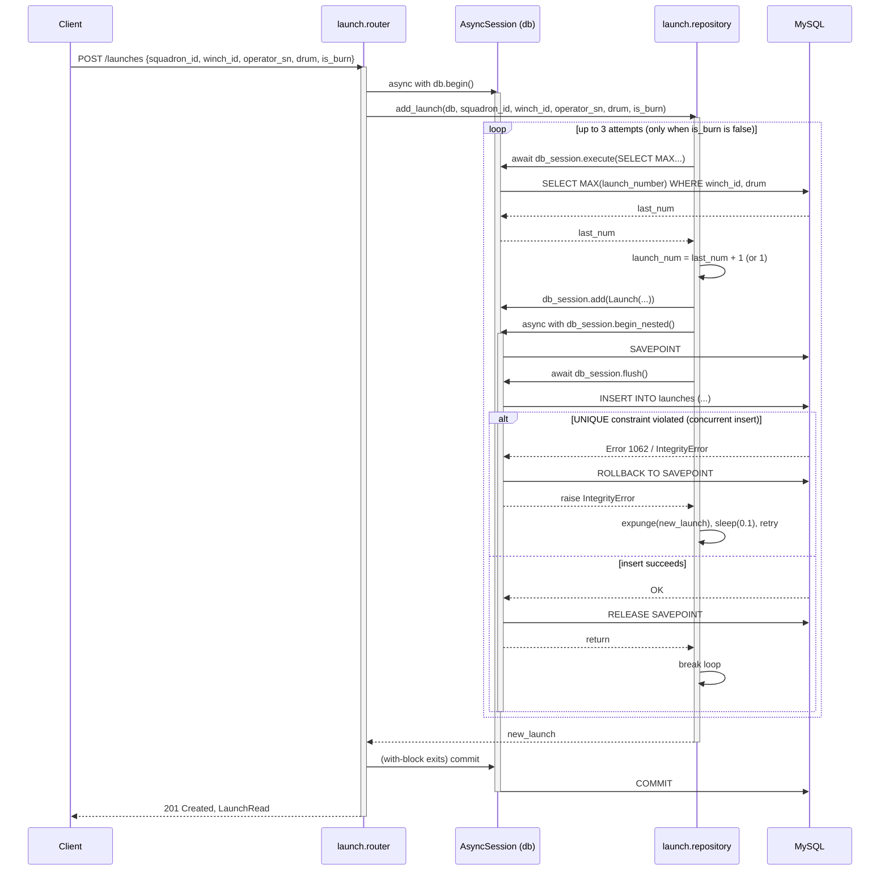
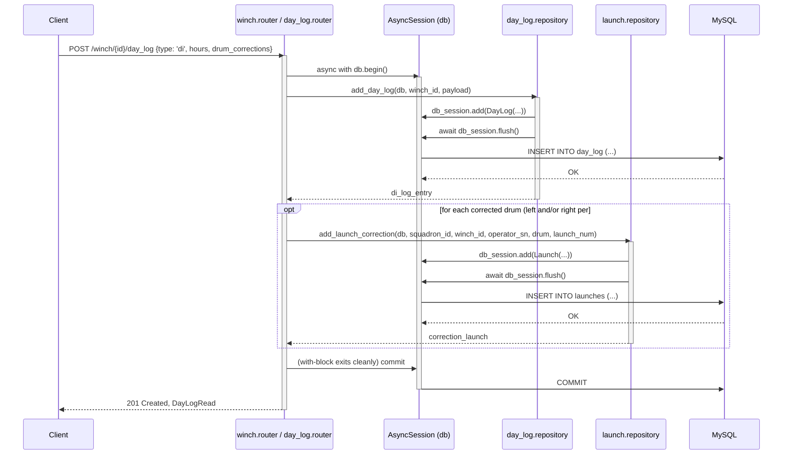

# Orchestrated write: sequence diagram

## Scope note

The parent issue names "Daily Inspection creation" as the example write that
spans two repositories inside one `db.begin()`. No `daily_inspection` domain,
and no write endpoint that opens two repositories inside a single
transaction, exists in this codebase as of this commit. This is a mismatch
between the doc plan and the code, not something this doc should paper over
— per the parent issue's own rule, this is tracked under **#80 (DI panel:
Launch number entry has no write function)**, which will introduce the first
multi-repository write transaction once implemented.

This document therefore provides two diagrams:

1. **Real-world transaction boundary**: `POST /launches`, in `domain.launch.router`.
   This is the write endpoint in the codebase where the transaction boundary does
   real work — it wraps a compare-and-retry loop against a `UNIQUE` constraint,
   using a nested transaction (`SAVEPOINT`) so a collision can be retried without
   losing the outer router-owned transaction.
2. **Architectural blueprint (orchestrated multi-repo write)**: The target pattern
   governed by ADR 0001 and planned under #80, showing how a router orchestrates
   two independent repositories within a single `db.begin()` atomic boundary.

---

## 1. `POST /launches` (Savepoint retry loop)

The sequence below depicts how `domain.launch.router.create_launch` and
`domain.launch.repository.add_launch` handle sequential launch numbers concurrently
without committing inside the repository:

### What this diagram is showing

- **The router owns the outer transaction.** `launch.router.create_launch`
  opens `async with db.begin()`; `launch.repository.add_launch` never calls
  `commit()` — only `flush()` and, inside the retry loop, the nested
  `begin_nested()` savepoint. This is the rule ADR 0001 documents.
- **The nested transaction is a retry boundary, not a cross-domain
  boundary.** `begin_nested()` here exists to isolate one `INSERT` attempt so
  a `launch_number` collision can be rolled back to its savepoint and retried
  without discarding the outer transaction.
- **`is_burn=True` skips the retry loop entirely** — burn launches do not receive
  a sequential `launch_number`, so there is no collision risk.
- **Failure exhaustion:** If all 3 attempts fail with `IntegrityError`, the error
  bubbles past `add_launch` to `create_launch`, causing the router's `async with db.begin()`
  block to roll back the entire transaction.

---

## 2. Blueprint: Multi-Repository Orchestrated Write (Issue #80)

When [Issue #80](https://github.com/Rodojodo/vikingwinch/issues/80) is implemented, signing
a Daily Inspection with corrected drum totals will become the codebase's first multi-repository
write transaction. Below is the blueprint showing how this pattern conforms to ADR 0001:

### Architectural invariants demonstrated

1. **Transaction boundary at the router:** Only the outer router opens `async with db.begin()`.
2. **Repositories remain decoupled:** `day_log.repository` and `launch.repository` have no
   knowledge of each other, nor do they manage transaction lifetimes.
3. **Atomic failure:** If `add_launch_correction` encounters a failure or constraint error,
   an exception propagates out of the router's `db.begin()` block, triggering an immediate
   `ROLLBACK` of both the launch correction *and* the daily inspection log entry.
4. **Router import contract note:** Implementing this endpoint in `day_log.router` will require adding
   `domain.day_log.router -> domain.launch.repository` to `.importlinter`'s `ignore_imports`, or alternatively placing
   the orchestration in `winch.router` and updating its read-only designation.

