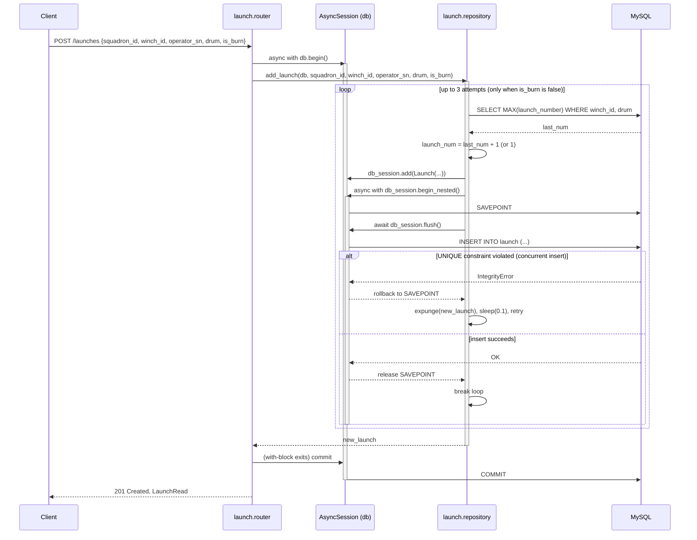

# Orchestrated write: sequence diagram

## Scope note

The parent issue names "Daily Inspection creation" as the example write that
spans two repositories inside one `db.begin()`. No `daily_inspection` domain,
and no write endpoint that opens two repositories inside a single
transaction, exists in this codebase as of this commit. This is a mismatch
between the doc plan and the code, not something this doc should paper over
— per the parent issue's own rule, it is filed as a separate issue rather
than invented here: **#TODO — no multi-repository write transaction exists;
either add one or correct the architecture doc plan to stop citing it.**

What follows instead is the clearest *real* example of the transaction-
ownership rule in effect: `POST /launches`, in `domain.launch.router`. It is
single-repository, but it is the one write endpoint in the codebase where
the transaction boundary does real work — it wraps a compare-and-retry loop
against a `UNIQUE` constraint, using a nested transaction (`SAVEPOINT`) so a
collision can be retried without losing the outer transaction.

## `POST /launches`

## What this diagram is actually showing

- **The router owns the outer transaction.** `launch.router.create_launch`
  opens `async with db.begin()`; `launch.repository.add_launch` never calls
  `commit()` — only `flush()` and, inside the retry loop, the nested
  `begin_nested()` savepoint. This is the rule the transaction-ownership ADR
  documents.
- **The nested transaction is a retry boundary, not a cross-domain
  boundary.** `begin_nested()` here exists to isolate one `INSERT` attempt so
  a `launch_number` collision can be rolled back and retried without
  discarding the outer transaction — it is not being used to compose writes
  across two domains' repositories, which is the pattern the parent issue
  actually asked to be diagrammed.
- **`is_burn=True` skips the retry loop entirely** — burn launches don't get
  a sequential `launch_number`, so there's nothing to collide on.
