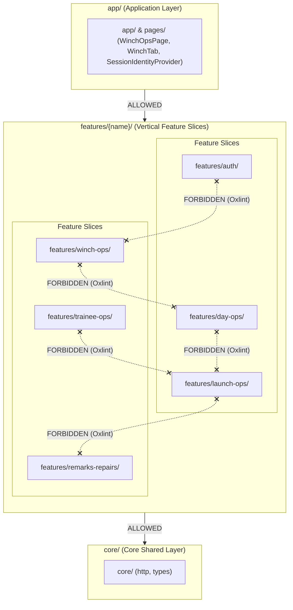
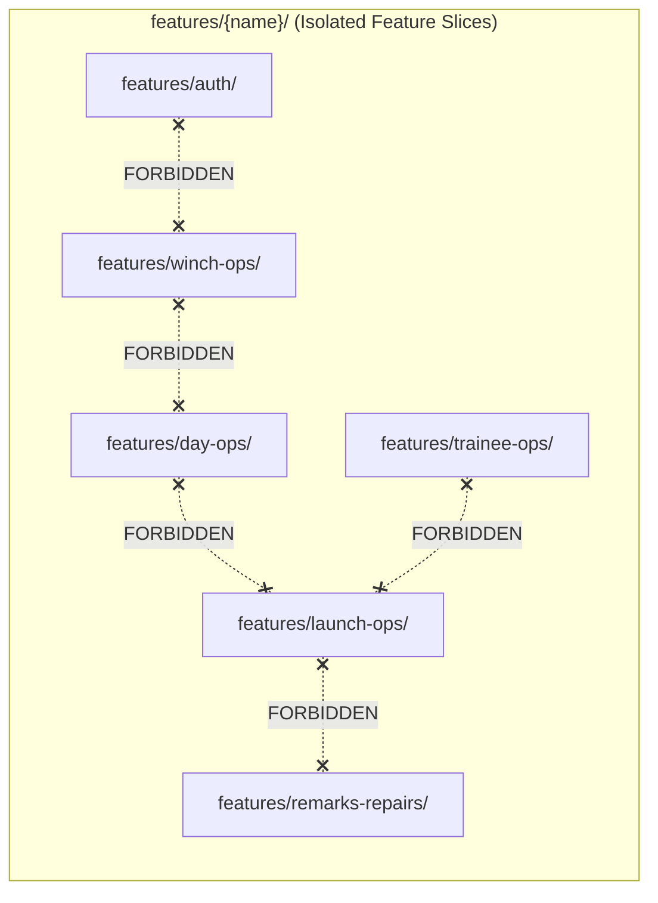
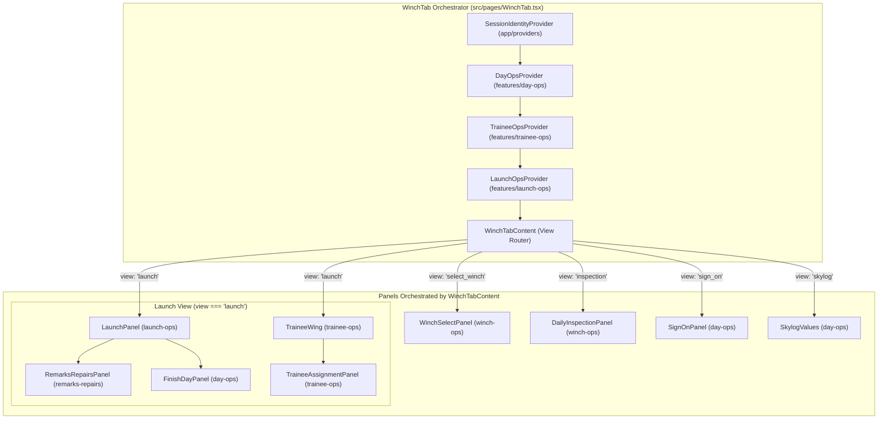

# Frontend feature diagram

Source of truth: `vikingwinch-frontend/.oxlintrc.json` and
`vikingwinch-frontend/src/app/featureBoundaries.test.ts`.

## Architecture Layers

The Viking Winch frontend enforces a strict unidirectional layer hierarchy:
`app/` → `features/{name}/` → `core/`. Lower layers must never depend on higher
layers, and feature slices must never import from sibling feature slices.



## Feature Slice Independence and Oxlint Enforcement

Sibling feature slices under `src/features/` are completely isolated. Direct cross-feature
imports are strictly forbidden by architectural rules and static linting.



### Linter Configuration (`.oxlintrc.json`)

Cross-feature boundary enforcement is automated via Oxlint's
`no-restricted-imports` rule in `vikingwinch-frontend/.oxlintrc.json`:

```json
{
  "overrides": [
    {
      "files": ["src/features/**"],
      "rules": {
        "no-restricted-imports": [
          "error",
          {
            "patterns": [
              {
                "group": [
                  "**/features/auth/**",
                  "**/features/auth",
                  "**/features/day-ops/**",
                  "**/features/day-ops",
                  "**/features/launch-ops/**",
                  "**/features/launch-ops",
                  "**/features/remarks-repairs/**",
                  "**/features/remarks-repairs",
                  "**/features/trainee-ops/**",
                  "**/features/trainee-ops",
                  "**/features/winch-ops/**",
                  "**/features/winch-ops",
                  "../*-ops/**",
                  "../*-ops",
                  "../../*-ops/**",
                  "../../*-ops",
                  "../../../*-ops/**",
                  "../../../*-ops",
                  "../remarks-repairs/**",
                  "../remarks-repairs",
                  "../../remarks-repairs/**",
                  "../../remarks-repairs",
                  "../../../remarks-repairs/**",
                  "../../../remarks-repairs",
                  "../auth/**",
                  "../auth",
                  "../../auth/**",
                  "../../auth",
                  "../../../auth/**",
                  "../../../auth"
                ],
                "message": "Cross-feature imports are forbidden outside src/app/."
              }
            ]
          }
        ]
      }
    }
  ]
}
```

### Automated Boundary Test (`featureBoundaries.test.ts`)

The boundary contract is verified in CI by
`src/app/featureBoundaries.test.ts`. This integration test creates a temporary
cross-feature import fixture (e.g. `day-ops` attempting to import from
`launch-ops`) and asserts that `npx oxlint` terminates with a non-zero exit
code and emits the error message:

> `"Cross-feature imports are forbidden outside src/app/."`

## Application-Layer Composition

Because features cannot communicate horizontally, all composition, provider
nesting, and cross-feature orchestration occur at the application layer in
`src/pages/WinchTab.tsx`:



### Orchestration Mechanics

1. **Crew & Active Launcher:** `TraineeOpsProvider` manages `traineeSn` and
   `activeLauncherSn`. `WinchTab` passes these as props into
   `LaunchOpsProvider`, so `LaunchOpsProvider` can resolve the effective
   operator without importing from `trainee-ops`.
2. **Remarks on Launches:** `RemarksRepairsPanel` is nested directly inside
   `LaunchPanel`. It collects remark input and submits it to the backend via
   `remarksClient.ts`. It invokes an `addRemark` callback prop passed down
   by `WinchTabContent`, which in turn calls `addRemarkToState` from
   `useLaunchOps()`. This dispatches `ADD_REMARK` into `launchReducer` without
   `remarks-repairs` importing `launch-ops`.
3. **Daily Inspections & Sign-On:** `DailyInspectionPanel` (from `winch-ops`)
   triggers `recordDI` from `useDayOps()`, and `SignOnPanel` (from `day-ops`)
   triggers `setTrainee` from `useTraineeOps()`, coordinated through view
   transitions in `WinchTabContent`.
4. **Session Lifecycle & Day Completion:** `FinishDayPanel` (nested within
   `LaunchPanel`) calls `handleExportLog` and day finish logic. `DayOpsProvider`
   fires `onDayFinished()`. `WinchTab` handles this callback to transition
   `SessionIdentityProvider` status to `{ status: 'closed', winchId }`.

## Feature Slices Directory Map

| Slice | Primary Path | State / Reducer | Key Responsibilities |
|---|---|---|---|
| `auth` | `src/features/auth/` | N/A (MSAL Context) | Microsoft Entra authentication, Graph API client, token acquisition |
| `day-ops` | `src/features/day-ops/` | `dayReducer.ts` | Daily logs, DI record, operator sign-on, day finish, `SignOnPanel`, `FinishDayPanel`, `SkylogValues` |
| `launch-ops` | `src/features/launch-ops/` | `launchReducer.ts` | Left/right drum launch execution, launch history, derived winch stats, `LaunchPanel`, `DrumControl` |
| `remarks-repairs` | `src/features/remarks-repairs/` | N/A (API client + UI) | Remark and repair entry panels (`RemarksRepairsPanel`), backend submission |
| `trainee-ops` | `src/features/trainee-ops/` | `traineeReducer.ts` | Trainee selection, active launcher assignment, `TraineeWing`, `TraineeAssignmentPanel` |
| `winch-ops` | `src/features/winch-ops/` | N/A (view routing) | Winch selection panel (`WinchSelectPanel`), daily inspection checklist panel (`DailyInspectionPanel`) |
