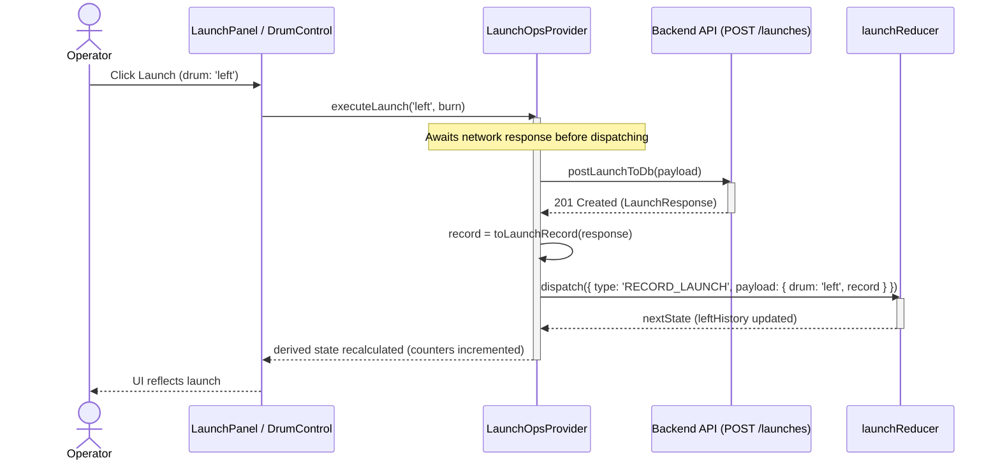
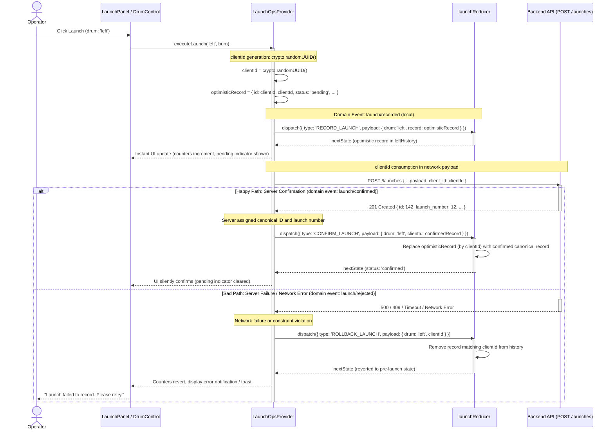

# Optimistic launch flow

## Scope Note & Codebase Status

In the current implementation (`src/features/launch-ops/providers/LaunchOpsProvider.tsx`),
launch recording is **pessimistic**:

```typescript
// Current implementation in LaunchOpsProvider.tsx (pessimistic wait)
const executeLaunch = useCallback(async (drum: DrumPosition, burn: boolean = false, traineeSnOverride?: string | null) => {
    // ... validation ...
    const response = await postLaunchToDb(payload);
    const record = toLaunchRecord(response);
    dispatch({ type: 'RECORD_LAUNCH', payload: { drum, record } });
}, [...]);
```

The user interface waits for the network round-trip and backend database
transaction before appending the launch record to state and updating the UI
counters.

This document describes:
1. **Current Pessimistic Flow**: How `LaunchOpsProvider` behaves today.
2. **Target Blueprint (Optimistic `clientId` Flow)**: The target architectural
   pattern detailing local `clientId` generation, immediate optimistic UI update,
   asynchronous server confirmation (`launch/confirmed`), rollback handling
   on rejection (`launch/rejected`), TypeScript schema requirements, and interaction
   with `undoLaunch`.

---

## 1. Current Pessimistic Flow



---

## 2. Target Blueprint: Optimistic Flow with `clientId`

In the optimistic architecture, a client-side unique identifier (`clientId`)
is generated locally. The launch record is immediately committed to the
local `launchReducer` state (`launch/recorded` local event) and reflected in the UI,
while the network request executes asynchronously in the background.



---

## Domain Events to Action Discriminator Mapping

The optimistic lifecycle coordinates high-level domain events with concrete
TypeScript reducer actions:

| Domain Event              | Reducer Action Discriminator                    | Payload                                                                   | Purpose                                                                                      |
|---------------------------|-------------------------------------------------|---------------------------------------------------------------------------|----------------------------------------------------------------------------------------------|
| `launch/recorded` (local) | `RECORD_LAUNCH` (or `RECORD_LAUNCH_OPTIMISTIC`) | `{ drum: DrumPosition, record: LaunchRecord }`                            | Appends optimistic record with `status: 'pending'` and generated `clientId` to local history |
| `launch/confirmed`        | `CONFIRM_LAUNCH`                                | `{ drum: DrumPosition, clientId: string, confirmedRecord: LaunchRecord }` | Swaps optimistic entry with canonical server-assigned `id` and `launch_number`               |
| `launch/rejected`         | `ROLLBACK_LAUNCH`                               | `{ drum: DrumPosition, clientId: string, error?: string }`                | Evicts the unconfirmed entry from history upon server or network failure                     |

---

## Strict TypeScript Schema Extensions

In the current codebase, `LaunchRecord.id` is typed strictly as `number`. To
support optimistic local records under strict TypeScript mode without unsafe
type assertions, `LaunchRecord` must be extended:

```typescript
export interface LaunchRecord {
  id: number | string;                 // number for persisted records, UUID string for optimistic records
  clientId?: string;                   // correlation UUID generated client-side
  status?: 'pending' | 'confirmed';    // operational status indicator
  launch_number: number | null;
  timestamp: string | null;
  remark: string | null;
  burn: boolean;
  operator_sn: string;
}
```

This allows `launchReducer` to match records deterministically and safely:
```typescript
case 'CONFIRM_LAUNCH': {
    const { drum, clientId, confirmedRecord } = action.payload;
    const swap = (history: LaunchRecord[]) =>
        history.map(rec => (rec.clientId === clientId || rec.id === clientId) ? confirmedRecord : rec);
    return drum === 'left'
        ? { ...state, leftHistory: swap(state.leftHistory) }
        : { ...state, rightHistory: swap(state.rightHistory) };
}
```

---

## Interaction with `undoLaunch`

In the field, an operator might immediately click "Undo" after dispatching a
launch. The optimistic model handles this through one of two coordinated policies:

1. **Guard / Disabled during pending dispatch (Recommended default):**
   The "Undo" button on a drum is disabled while `leftLastRecord?.status === 'pending'`
   or `rightLastRecord?.status === 'pending'`. This prevents race conditions where an
   undo request attempts to delete an entity on the backend that has not yet finished
   creating.
2. **Immediate Local Rollback & Request Cancellation:**
   If undo is permitted on a pending launch, `undoLaunch` cancels the in-flight
   `fetch` request using an `AbortController.abort()`, dispatches `ROLLBACK_LAUNCH`
   locally, and avoids issuing a `DELETE /launches/{id}` call to the backend.

---

## Architectural Mechanics of Optimistic Coordination

### 1. Client Identifier (`clientId`)
- **Generation:** Produced client-side via `crypto.randomUUID()`.
- **Purpose:** Acts as the temporary correlation key linking the local
  optimistic entry in `leftHistory` / `rightHistory` to the asynchronous HTTP
  request.
- **Backend Correlation:** When the backend implements `clientId` echo, it
  guarantees deduplication (idempotency) if network retries occur.

### 2. Immediate Feedback Loop
- Downstream derived state (`useMemo` in `LaunchOpsProvider`) updates
  synchronously upon the initial `RECORD_LAUNCH` dispatch.
- Total launches (`leftTotal`, `rightTotal`), non-burn launches (`leftLaunches`,
  `rightLaunches`), and `lastDrum` update in the same animation frame,
  eliminating perceived latency for the winch operator in the field.

### 3. Reconciling Server Confirmation
- The backend assigns the canonical primary key (`id: number`) and the
  official sequential launch number (`launch_number: number`, generated under
  the savepoint retry loop documented in
  `docs/diagrams/backend-orchestrated-write-sequence.md`).
- Confirmation swaps the pending entry with the confirmed canonical record.

### 4. Rollback and Invariant Preservation
- If the HTTP request fails (network interruption, 5xx server error, or
  irrecoverable integrity collision), the optimistic record is purged via
  `ROLLBACK_LAUNCH`.
- Counters and last launch timestamps revert to pre-launch state.
- A toast or alert surfaces the failure to the operator.

---

## Comparison Summary

| Attribute | Current Implementation (Pessimistic) | Target Blueprint (Optimistic) |
|---|---|---|
| **Dispatch Timing** | After `postLaunchToDb` resolves | Immediately on user action |
| **Operator Latency** | 100ms – 1500ms (network dependent) | ~0ms (instantaneous) |
| **Correlation Key** | Server-generated numeric `id` | Client UUID (`clientId`) transitioning to server `id` |
| **Failure Recovery** | Nothing dispatched; error caught in UI | Explicit rollback action (`ROLLBACK_LAUNCH`) |
| **Reducer Actions** | `RECORD_LAUNCH`, `UNDO_LAUNCH` | `RECORD_LAUNCH`, `CONFIRM_LAUNCH`, `ROLLBACK_LAUNCH` |
| **Undo Interaction** | Calls `removeLaunchFromDb(record.id)` | Guarded while pending, or cancels in-flight abort controller |
