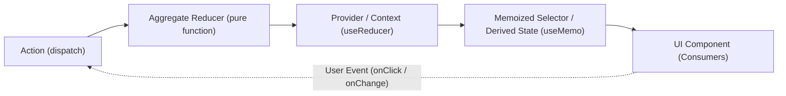

# Frontend State Flow and Reducer Reference Guide

## Overview

The Viking Winch frontend follows a strict unidirectional state flow based on
pure aggregate reducers and React Context providers. This architecture ensures
predictable state transitions, eliminates cross-feature coupling, and maintains
optimal rendering performance.



---

## State Flow Lifecycle: Step by Step

### 1. User Event in UI Component
An operator interacts with an interactive element (e.g. clicking "Launch" in
`DrumControl` or submitting a remark in `RemarksRepairsPanel`).

```tsx
// Inside DrumControl.tsx
<Button onClick={() => onLaunch(drum, false)}>
    Launch
</Button>
```

### 2. Custom Hook Invocation
The component calls a handler exposed by a feature-specific hook (e.g.
`useLaunchOps()`, `useDayOps()`, or `useTraineeOps()`):

```tsx
// In LaunchPanel.tsx
const { executeLaunch } = useLaunchOps();
```

### 3. Action Dispatch
The provider performs necessary side effects (such as asynchronous HTTP calls)
and dispatches a strongly-typed action object containing a `type` discriminator
and a typed `payload`:

```typescript
// Inside LaunchOpsProvider.tsx
const response = await postLaunchToDb(payload);
const record = toLaunchRecord(response);
dispatch({ type: 'RECORD_LAUNCH', payload: { drum, record } });
```

### 4. Pure Reducer State Computation
The aggregate reducer receives the current `state` and the `action`. It computes
the next state without mutating the existing state object:

```typescript
// Inside launchReducer.ts
export const launchReducer = (state: LaunchState, action: LaunchAction): LaunchState => {
    switch (action.type) {
        case 'RECORD_LAUNCH': {
            const { drum, record } = action.payload;
            if (drum === 'left') {
                return { ...state, leftHistory: [...state.leftHistory, record] };
            }
            return { ...state, rightHistory: [...state.rightHistory, record] };
        }
        // ...
        default:
            return state;
    }
};
```

### 5. Context Value and Derived Selectors
The provider holds the reducer state via `useReducer`. Derived statistics are
computed via `useMemo` using the reducer `state` as a dependency:

```typescript
// Inside LaunchOpsProvider.tsx
const [state, dispatch] = useReducer(launchReducer, initialLaunchState);

const derived = useMemo<DerivedWinchState>(() => {
    const leftTotal = state.leftHistory.length;
    const rightTotal = state.rightHistory.length;
    // ... calculate launch totals, last launch times, active drum ...
    return { leftTotal, rightTotal, leftLaunches, rightLaunches, ... };
}, [state]);
```

### 6. Component Re-rendering
Downstream components subscribing to the context receive the updated state and
re-render to reflect the change.

---

## The Object Identity-Preservation Rule

> [!IMPORTANT]
> **The Golden Rule of Reducers:**
> If an action is unhandled, unrecognized, or results in no effective change,
> the reducer **MUST return the exact existing `state` reference**.
> **NEVER** return a newly spread object `{ ...state }` on the default or no-op path.

### Why Identity Preservation Matters in React

React's `useReducer` and Context API rely strictly on referential equality
(`Object.is(prevState, nextState)`):

1. **`Object.is` Comparison:** When `dispatch(action)` is called, React compares
   the returned state against the previous state using `Object.is`.
2. **Referential Invalidation:** If a reducer returns `{ ...state }`, a new object
   is allocated in memory. Even though every single property inside the object is
   identical, `Object.is(prevState, nextState)` evaluates to `false`.
3. **Selector Busting:** When `state` referential identity changes:
   - Every `useMemo(..., [state])` (such as `derived` in `LaunchOpsProvider`) is
     invalidated and re-executes.
   - Any context value depending on `state` or `derived` changes reference.
4. **Re-render Cascades:** Every component subscribed to the context — along
   with its child component tree — is forced to re-render, degrading UI
   responsiveness and draining mobile/tablet battery life on the airfield.

---

### Context-Value Memoization Requirement

State identity preservation in the reducer is only half the equation: the
**Provider context value itself must also be referentially stable**.

If a provider passes an unmemoized inline object literal to its context provider:

```tsx
// ⚠️ ANTI-PATTERN: Re-creates context value object on EVERY provider re-render
<LaunchOpsContext.Provider
    value={{
        leftHistory: state.leftHistory,
        rightHistory: state.rightHistory,
        derived,
        executeLaunch,
        undoLaunch,
        hydrateHistory,
        addRemarkToState,
    }}
>
    {children}
</LaunchOpsContext.Provider>
```

Then whenever any parent re-renders (e.g. `WinchTab` re-rendering due to an
operator list update), `value={{ ... }}` allocates a new object reference,
causing all `useLaunchOps()` consumers to re-render even though reducer `state`
did not change.

**Recommended Pattern:** Memoize the context value or ensure callback props
(`executeLaunch`, `undoLaunch`, etc.) are wrapped in `useCallback` and the value
object is wrapped in `useMemo`:

```tsx
const contextValue = useMemo(() => ({
    leftHistory: state.leftHistory,
    rightHistory: state.rightHistory,
    derived,
    executeLaunch,
    undoLaunch,
    hydrateHistory,
    addRemarkToState,
}), [state.leftHistory, state.rightHistory, derived, executeLaunch, undoLaunch, hydrateHistory, addRemarkToState]);

return (
    <LaunchOpsContext.Provider value={contextValue}>
        {children}
    </LaunchOpsContext.Provider>
);
```

---

### Code Comparison

#### ❌ Anti-Pattern: Spreading State on Default or No-Op

```typescript
// ❌ WRONG: Allocates a new object on every unknown or no-op action
export const badLaunchReducer = (state: LaunchState, action: LaunchAction): LaunchState => {
    switch (action.type) {
        case 'RECORD_LAUNCH':
            return {
                ...state,
                leftHistory: [...state.leftHistory, action.payload.record],
            };

        // DANGEROUS ANTI-PATTERN:
        default:
            return { ...state }; // Breaks Object.is() equality!
    }
};
```

**Consequence:** Any component dispatching an unhandled action triggers a full
re-render cascade of all launch controls and stickers, even though zero launch
data changed.

#### ✅ Correct Pattern: Preserving Object Reference

```typescript
// ✅ CORRECT: Preserves referential identity
export const launchReducer = (state: LaunchState, action: LaunchAction): LaunchState => {
    switch (action.type) {
        case 'RECORD_LAUNCH': {
            const { drum, record } = action.payload;
            if (drum === 'left') {
                return { ...state, leftHistory: [...state.leftHistory, record] };
            }
            return { ...state, rightHistory: [...state.rightHistory, record] };
        }
        case 'UNDO_LAUNCH': {
            if (action.payload.drum === 'left') {
                return { ...state, leftHistory: state.leftHistory.slice(0, -1) };
            }
            return { ...state, rightHistory: state.rightHistory.slice(0, -1) };
        }
        case 'HYDRATE_HISTORY': {
            return {
                ...state,
                leftHistory: action.payload.left,
                rightHistory: action.payload.right,
            };
        }
        case 'ADD_REMARK': {
            const { drum, id, remark } = action.payload;
            const updateHistory = (history: typeof state.leftHistory) =>
                history.map(record => record.id === id ? { ...record, remark } : record);

            if (drum === 'left') {
                return { ...state, leftHistory: updateHistory(state.leftHistory) };
            }
            return { ...state, rightHistory: updateHistory(state.rightHistory) };
        }
        default:
            // Safe: React sees Object.is(prevState, nextState) === true and skips re-renders
            return state;
    }
};
```

---

### Recommended No-Op Optimization Patterns

In addition to unhandled default cases, certain actions produce no effective
change under specific state preconditions. Reducers should return `state`
directly in these cases rather than allocating new objects or arrays:

1. **Active Launcher No-Op (`traineeReducer`):**
   *(Recommended optimization pattern — note that `traineeReducer.ts` currently
   spreads unconditionally; adding this guard prevents redundant renders when
   selecting the already-active launcher)*:
   ```typescript
   case 'SET_ACTIVE_LAUNCHER':
       if (state.activeLauncherSn === action.payload) {
           return state; // No-op: preserve reference
       }
       return {
           ...state,
           activeLauncherSn: action.payload,
       };
   ```

2. **Undo on Empty History (`launchReducer`):**
   If `UNDO_LAUNCH` is dispatched on a drum with no launches, `slice(0, -1)`
   allocates a new empty array `[]`. Checking length first preserves reference:
   ```typescript
   case 'UNDO_LAUNCH': {
       const history = action.payload.drum === 'left' ? state.leftHistory : state.rightHistory;
       if (history.length === 0) {
           return state; // No launches to undo: preserve reference
       }
       return action.payload.drum === 'left'
           ? { ...state, leftHistory: state.leftHistory.slice(0, -1) }
           : { ...state, rightHistory: state.rightHistory.slice(0, -1) };
   }
   ```

3. **Remark on Non-Existent Launch (`launchReducer`):**
   If `ADD_REMARK` targets an ID not present in the drum history, `map()`
   allocates a new array. Verifying record existence preserves reference:
   ```typescript
   case 'ADD_REMARK': {
       const { drum, id, remark } = action.payload;
       const history = drum === 'left' ? state.leftHistory : state.rightHistory;
       const exists = history.some(record => record.id === id);
       if (!exists) {
           return state; // Record not found: preserve reference
       }
       // proceed with map...
   }
   ```

---

## Reducer Architecture in Viking Winch

| Reducer | Location | Aggregate Owned | Actions Handled | Identity Preservation Implemented |
|---|---|---|---|---|
| `launchReducer` | `src/features/launch-ops/state/launchReducer.ts` | Launch history (`leftHistory`, `rightHistory`, remarks) | `RECORD_LAUNCH`, `UNDO_LAUNCH`, `HYDRATE_HISTORY`, `ADD_REMARK` | `default: return state;` |
| `traineeReducer` | `src/features/trainee-ops/state/traineeReducer.ts` | Trainee & active launcher selection | `SET_TRAINEE`, `SET_ACTIVE_LAUNCHER` | `default: return state;` |
| `dayReducer` | `src/features/day-ops/state/dayReducer.ts` | Daily lifecycle, DI, and sign-on flags | `FINISH_DAY`, `RECORD_SIGN_ON`, `RECORD_DI`, `RESET_DAY` | `default: return state;` |

All Viking Winch reducers strictly conform to this identity-preservation rule,
ensuring high-speed operation and zero unneeded re-renders during high-frequency
field operations.
